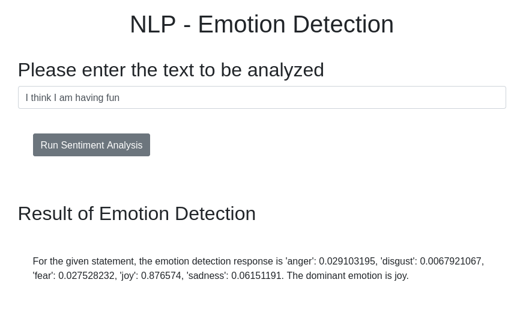
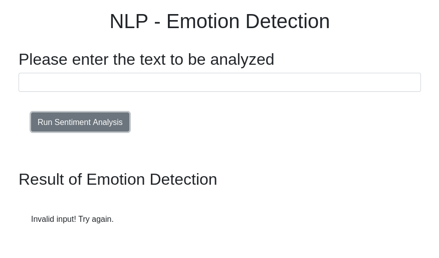

# Emotion Detection Web App (IBM Generative AI Engineering - Course 5 Final Project)

**Final Project: AI-Powered Customer Feedback Analyzer**  
*Completed June 2026 | IBM Generative AI Engineering Professional Certificate*

 


## Business Scenario
An e-commerce company needs an AI-based web application to analyze customer feedback emotions for their products. This Flask app uses IBM Watson NLP to detect emotions (joy, sadness, anger, fear, etc.) from text input and returns structured results.

**Key Outcomes**:
- Real-time emotion analysis via REST API
- Robust error handling and input validation
- Fully packaged, tested, and production-ready structure
- Demonstrates end-to-end AI application development

## Features
- **Emotion Detection Engine** (`emotion_detection.py`): Processes text and returns emotion scores using Watson NLP.
- **Flask Web App** (`server.py`): RESTful endpoints, dynamic routing, JSON responses, proper HTTP status codes.
- **Frontend**: Simple HTML/JS interface for testing.
- **Testing**: Comprehensive unit tests with `unittest` (100% coverage on core functions).
- **Packaging**: Modular structure with `__init__.py`, following PEP 8 and best practices.
- **Error Handling**: Graceful 400 responses for blank/invalid input, timeouts, etc.

## Tech Stack
- **Backend**: Python, Flask (micro-framework), Watson NLP
- **Testing**: unittest
- **Frontend**: HTML, JavaScript
- **Deployment**: Local / Cloud IDE / Docker-ready

## Project Structure
```
oaqjp-final-project-emb-ai/
├── EmotionDetection/          # Packaged module
├── static/                    # JS & assets
├── templates/                 # HTML templates
├── submission_files/          # Grader artifacts
├── emotion_detection.py
├── server.py
├── test_emotion_detection.py
├── requirements.txt (or equivalent)
└── README.md
```

## Quick Start
1. Clone the repo: 
```bash
git clone https://github.com/shainemeister/oaqjp-final-project-emb-ai.git
```

2. Install dependencies:
```bash
pip install -r requirements.txt
```

3. Run the app:
```bash
python server.py
```

4. Open `http://127.0.0.1:5000` and test emotion detection.

## Screenshots / Demo
 
*Screenshot for error handling*

## What I Learned / Skills Demonstrated
- Full application development lifecycle (requirements → design → code/test → deploy)
- Flask routing, request/response handling, Jinja templating
- Packaging Python modules and unit testing
- Integrating external AI APIs (Watson NLP)
- Error handling, logging, and production considerations
- Prompt engineering & AI application patterns (ties into earlier IBM courses)

---

**License**: Apache-2.0  
**Last Updated**: 2026-06-12
